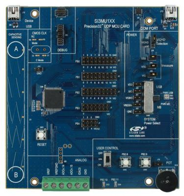

.. _sim3u1xx_b_dk:

SiM3U1xx-B-DK
#############

Overview
********

The SiM3U1xx MCU card enables application development on the SiM3U1xx MCUs.

   SiM3U1xx-B-DK (image courtesy of Silicon Labs)

Hardware
********

- SiM3U167-A-GQ SoC
- 2 user buttons
- 2 LEDs
- a touch slider and 2 touch buttons
- a potentiometer

For more information about the SiM3U SoC and SiM3U1xx-B-DK board:

- `SIM3U Website`_
- `SIM3U Datasheet`_
- `SIM3U Reference Manual`_
- `SiM3U1xx-B-DK Website`_
- `SiM3U1xx-B-DK User Guide`_

Supported Features
==================

The sim3u1xx_b_dk board configuration supports the following hardware features:

+-----------+------------+-------------------------------------+
| Interface | Controller | Driver/Component                    |
+===========+============+=====================================+
| NVIC      | on-chip    | nested vector interrupt controller  |
+-----------+------------+-------------------------------------+
| SYSTICK   | on-chip    | systick                             |
+-----------+------------+-------------------------------------+
| FLASH     | on-chip    | flash memory                        |
+-----------+------------+-------------------------------------+
| GPIO      | on-chip    | gpio                                |
+-----------+------------+-------------------------------------+
| UART      | on-chip    | serial port-polling;                |
|           |            | serial port-interrupt               |
+-----------+------------+-------------------------------------+

The default configuration can be found in the defconfig file:

	``boards/arm/sim3u1xx_b_dk/sim3u1xx_b_dk_defconfig``

Other hardware features are currently not supported by the port.

Connections and IOs
===================

The SiM3U1xx SoC has five gpio controllers (PB0 to PB4), but only four are
currently enabled (PB0, PB1, PB2 and PB3) for the SiM3U1xx-B-DK board.

In the following table, the column Name contains Pin names. For example, PB0.1
means Pin number 1 on PB0, as used in the board's datasheets and manuals.

+----------+-------------+-------------------------------------+
| Name     | Function    | Usage                               |
+==========+=============+=====================================+
| PB2.10   | GPIO        | LED0 (Red LED DS3)                  |
+----------+-------------+-------------------------------------+
| PB2.11   | GPIO        | LED1 (Yellow LED DS4)               |
+----------+-------------+-------------------------------------+
| PB2.8    | GPIO        | Push Button SW2                     |
+----------+-------------+-------------------------------------+
| PB2.9    | GPIO        | Push Button SW3                     |
+----------+-------------+-------------------------------------+
| PB1.12   | UART0_TX    | UART Console UART0 TX               |
+----------+-------------+-------------------------------------+
| PB1.13   | UART0_RX    | UART Console UART0 RX               |
+----------+-------------+-------------------------------------+

System Clock
============

The SiM3U1xx SoC is configured to use the 20 MHz internal oscillator.

Serial Port
===========

The SiM3U1xx SoC has two USARTs and two UARTs. UART0 is connected to the
on-board CP210x USB-to-UART bridge and is used for the console.

Programming and Debugging
*************************

The SiM3U1xx-B-DK does not include any on-board debugger. It provides a mini
10-pin debug header which can be used for SWD and JTAG debugging.

Flashing
========

An `J-Link`_ debug adaptor can be used to debug and flash the SoC.

Flashing an application to SiM3U1xx-B-DK
----------------------------------------

The sample application :ref:`hello_world` is used for this example.
Build the Zephyr kernel and application:

.. zephyr-app-commands::
   :zephyr-app: samples/hello_world
   :board: sim3u1xx_b_dk
   :goals: build

Connect the SiM3U1xx-B-DK to your host computer using the USB port and an 
`J-Link`_ debug adaptor.

.. zephyr-app-commands::
   :zephyr-app: samples/hello_world
   :board: sim3u1xx_b_dk
   :goals: flash

Open a serial terminal (minicom, putty, etc.) with the following settings:

- Speed: 115200
- Data: 8 bits
- Parity: None
- Stop bits: 1

Reset the board and you should be able to see on the corresponding Serial Port
the following message:

.. code-block:: console

   Hello World! arm

.. _SiM3U1xx-B-DK Website:
   https://www.silabs.com/products/development-tools/mcu/32-bit/sim3u1xx-32-bit-mcu-usb-development-kit

.. _SiM3U1xx-B-DK User Guide:
   https://www.silabs.com/documents/public/user-guides/UPMU-M3U160.pdf

.. _SIM3U Website:
   https://www.silabs.com/products/mcu/32-bit/precision32-sim3u1xx

.. _SIM3U Datasheet:
   https://www.silabs.com/documents/public/data-sheets/SiM3U1xx.pdf

.. _SIM3U Reference Manual:
   https://www.silabs.com/documents/public/data-sheets/SiM3U1xx-SiM3C1xx-RM.pdf

.. _J-Link:
   https://www.segger.com/jlink-debug-probes.html

.. _J-Link-Downloads:
   https://www.segger.com/downloads/jlink
